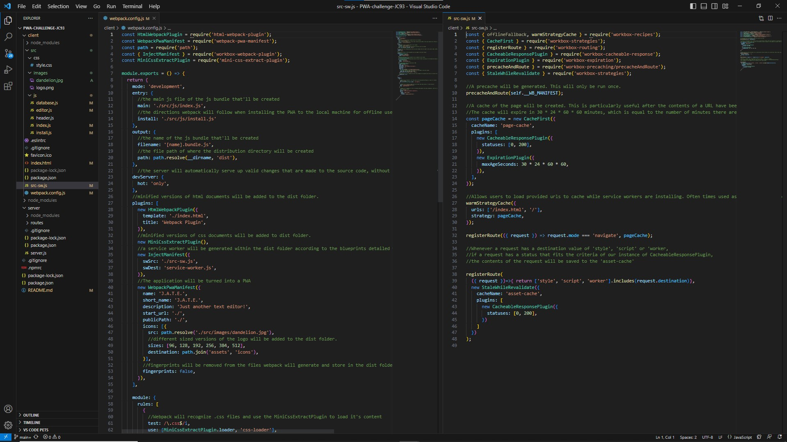

# PWA-challenge-JC93
A Progressive Web Application Challenge

## Technologies Used
| Javascript                | (https://developer.mozilla.org/en-US/docs/Web/JavaScript)
| Webpack                   | (https://webpack.js.org/)
| Webpack PWA Manifest      | (https://www.npmjs.com/package/webpack-pwa-manifest)
| Workbox Webpack Plugin    | (https://www.npmjs.com/package/workbox-webpack-plugin)
| HTML Webpack Plugin       | (https://webpack.js.org/plugins/html-webpack-plugin/)
| Express                   | (https://expressjs.com/)
| Babel Loader              | (https://www.npmjs.com/package/babel-loader)
| Style Loader              | (https://www.npmjs.com/package/style-loader)
| CSS Loader                | (https://www.npmjs.com/package/css-loader)

## Description

    At first glance, it's just another text editor! But what makes this text editor special is the fact that its a PWA! What is a PWA you ask? PWA stands for Progressive Web Application. Which is really just a fancy way to say that it's a new and improved version of a traditional web application, that's been designed to store caches and cookies in a more effective way so that the user's experience is faster, all the more enjoyable. 

    In our case, J.A.T.E has been designed to be installable from the browser at the click of a button, making it available for offline, without compromising performance. 

    Not only that, J.A.T.E. uses localStorage and an indexedDB to back-up and save the content that the user adds to the notepad. 

## Installation

    1. Download repository
    2. Navigate to the root directory
    3. run ~$ npm i
    4. run ~$ npm run start:dev
    5. The app is now accessible at localhost:3000
    6. Open application in web browser @localhost:3000
    7. Click install button
    8. The application is now available for use on your machine!
  

## Usage
   1. Open application
   2. It's just another text editor! Type away!

## Learning Points
    
    This challenge was a great opportunity to practice working with webpack and it's plugins. They allowed us to register customized service workers, create manifests as well as convert our js, css and html files into minified, yet still fully functional versions of themselves. 

    Not only that, thanks to Webpack's PWA Manifest plugin, we were also able to provide users with the option of installing/downloading the application to their local machines, for offline use. 

    And althought not as apparent, working on this project was also a great opportunity to practice working with both local storage, and indexedDB, the conccurent use of which greatly improved the reliability of our app. 
    
## The Code

## Credits
* [LinkedIn](https://linkedin.com/in/justinchoica)
* [Github](https://github.com/justinschoi93)
* [Email](justinschoi93@gmail.com)
